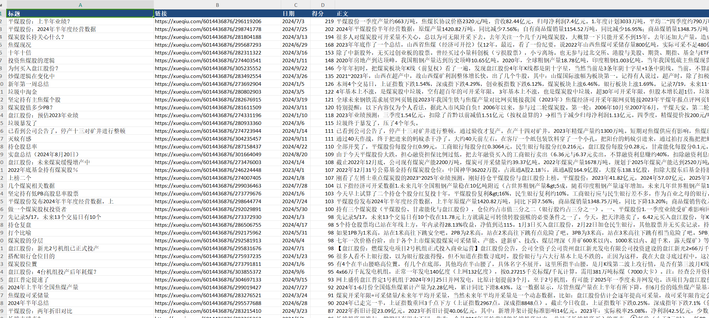
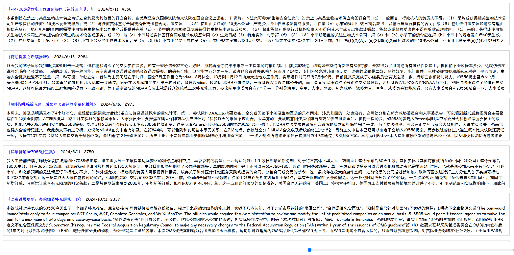

# Prepare
1. Modify Cookie in service.js
2. Modify Params in main.js


# Execute
```bash
npm i
node main.js
```

# Result
in data/ fold

```
// 本地: http://localhost:3142/index.html
// 部署:  https://vercel.com/archks-projects/xueqiu-search
// 外部:  https://xueqiu-search.vercel.app/index.html

```






